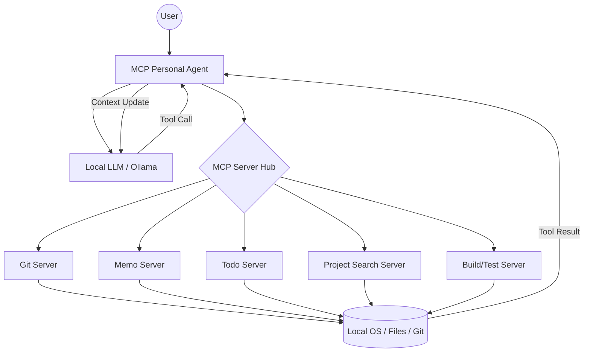

**MCP Personal Agent**는 단순한 챗봇을 넘어, 로컬 개발 환경에서 스스로 계획을 세우고, 도구를 선택하며, 결과를 검증하고 수정하는 **자율형 퍼스널 AI 에이전트**입니다. Model Context Protocol(MCP)을 통해 LLM이 내 컴퓨터의 파일, Git, 메모, 터미널에 안전하게 접근하여 실제 작업을 수행하도록 설계되었습니다.

---

## 🌟 핵심 엔지니어링 포인트 (Key Features)

### 1. 자율적 문제 해결 루프 (Autonomous Self-Correction Loop)
에이전트는 단순한 코드 생성이 아니라, **엔지니어의 실제 작업 방식**을 모사합니다.
- **Workflow:** `요청 분석` $\rightarrow$ `관련 파일 검색` $\rightarrow$ `코드 분석` $\rightarrow$ `수정 적용` $\rightarrow$ `빌드 및 테스트 실행` $\rightarrow$ `에러 분석` $\rightarrow$ `재수정`.
- **특징:** 빌드 실패 시 에러 로그를 스스로 읽고, 다시 관련 파일을 검색하여 문제를 해결할 때까지 루프를 반복하는 **Self-healing** 능력을 갖추고 있습니다.

### 2. 모듈형 MCP 서버 아키텍처 (Modular MCP Architecture)
기능별로 서버를 분리하여 확장성과 유지보수성을 높였습니다.
- **`git-server`**: Git 상태 확인, Diff 분석, 커밋 히스토리 추적.
- **`memo-server`**: JSON 기반의 영구 저장소를 이용한 개인 지식베이스 관리.
- **`todo-server`**: 정교한 할 일 관리 및 상태 추적.
- **`project-search-server`**: 대규모 프로젝트 내 파일 검색 및 코드 분석.
- **`build-test-server`**: 로컬 빌드 도구와의 연동 및 결과 검증.

### 3. 컨텍스트 인지 메모리 시스템 (Context-aware Memory)
LLM의 컨텍스트 윈도우 제한을 극복하기 위해 다층 메모리 구조를 도입했습니다.
- **Short-term:** 현재 대화의 흐름과 도구 호출 결과 유지.
- **Long-term:** 중요 정보, 사용자 선호도, 과거 작업 요약을 `memory/` 폴더의 JSON 파일로 영구 저장하여 세션이 바뀌어도 기억을 유지합니다.

### 4. 안전한 시스템 제어 (Risk Control & Approval)
로컬 시스템 접근에 따른 위험을 방지하기 위해 **Human-in-the-loop** 설계를 도입했습니다.
- 위험도가 높은 쉘 명령어 실행 전 사용자의 명시적 승인을 요청하는 `Approval` 레이어를 구현하여 안전성을 확보했습니다.

---

## 📐 시스템 아키텍처 (System Architecture)



---

## 🛠️ 설치 및 실행 방법 (Getting Started)

### 사전 요구사항
- **Node.js** (v18 이상 권장)
- **Ollama** (로컬 LLM 실행 환경) 및 모델 설치 (예: `llama3`, `mistral` 등)

### 설치 단계
1. **저장소 클론 및 의존성 설치**
   ```bash
   git clone <repository-url>
   cd mcp-personal-agent-main
   npm install
   ```

2. **환경 설정**
   - `.env` 파일을 생성하고 Ollama API 주소 및 기본 워크스페이스 경로를 설정합니다.
   ```env
   OLLAMA_BASE_URL=http://localhost:11434
   WORKSPACE_ROOT=C:/Your/Project/Path
   ```

3. **프로젝트 빌드**
   ```bash
   npm run build
   ```

### 실행 방법
- **개발 모드 (tsx):**
  ```bash
  npm run dev
  ```
- **프로덕션 모드 (compiled JS):**
  ```bash
  npm run start
  ```

---

## 🚀 주요 기능 시나리오 (Example Use Cases)

- **코드 자동 수정 및 검증:** "현재 프로젝트의 `AuthService`에서 로그인 버그를 찾아 수정하고, 빌드가 성공하는지 확인해줘."
- **개인 지식베이스 구축:** "오늘 배운 MCP 프로토콜의 핵심 내용을 메모에 저장하고, 내일 오전 10시까지 정리해서 보고하도록 할 일에 추가해줘."
- **프로젝트 분석:** "이 프로젝트의 전반적인 구조를 분석해서 `README.md`에 반영해줘."
- **Git 워크플로우 자동화:** "현재 변경 사항을 분석해서 적절한 커밋 메시지를 제안하고, 충돌이 없는지 확인해줘."

---

## 📂 프로젝트 구조
- `src/agent/`: 에이전트의 뇌에 해당하는 루프 및 클라이언트 로직.
- `src/mcp-servers/`: 각 기능별 MCP 서버 구현체.
- `src/shared/`: 공통 타입, 메모리 스토어, 워크스페이스 관리 유틸리티.
- `memory/`: 에이전트의 영구 기억이 저장되는 JSON DB.
