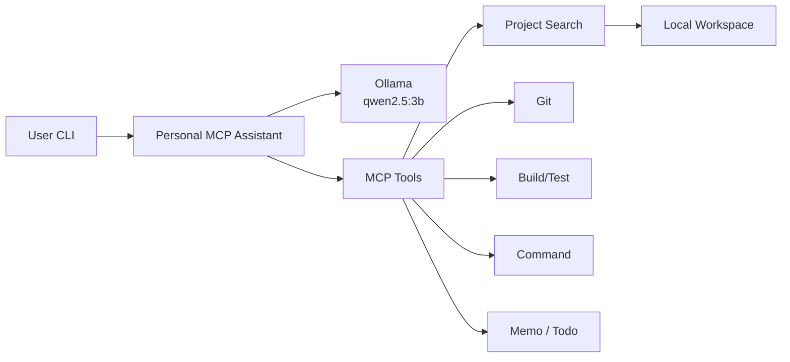

# cortexa

LLM이 단순히 질문에 답변하는 수준을 넘어, **로컬 개발 환경에서 실제 작업을 수행할 수 있는 자율형 AI Agent 시스템**을 구현한 프로젝트입니다.

기존 Chatbot 기반 LLM 서비스는 텍스트 응답까지만 가능하지만, 실제 개발 업무에서는 코드 수정, 파일 검색, 빌드 실행, Git 상태 확인, 에러 분석과 같은 작업 수행 능력이 필요합니다.

이 프로젝트는 **Model Context Protocol (MCP)** 기반 Tool Calling 구조를 이용하여, AI Agent가 로컬 시스템과 안전하게 상호작용하며 스스로 문제를 해결할 수 있는 Personal Agent Architecture를 설계하는 것을 목표로 개발하였습니다.

---

## System Architecture



> AI Agent autonomously selects tools, executes local tasks, analyzes results, updates memory, and performs iterative self-correction.

## 프로젝트 목표

기존 LLM 기반 Assistant는 다음과 같은 한계가 존재했습니다.

* 텍스트 응답만 가능하고 실제 작업 수행 불가
* 프로젝트 파일 분석 및 코드 수정 자동화 어려움
* 에러 발생 시 반복적인 문제 해결 수행 불가
* 사용자 Context 및 장기 메모리 유지 어려움

이를 해결하기 위해 실제 로컬 환경과 연결되는 자율형 AI Agent를 설계하였습니다.

---

## 핵심 기능

### 1. Autonomous Agent Workflow

AI Agent가 실제 엔지니어 작업 방식과 유사한 흐름으로 동작하도록 설계하였습니다.

```text
사용자 요청 분석
      ↓
관련 파일 검색
      ↓
코드 분석
      ↓
코드 수정 적용
      ↓
Build/Test 실행
      ↓
Error Log 분석
      ↓
문제 발생 시 재수정 반복
```

단순 코드 생성이 아닌 **Self-Correction Loop** 구조를 구현하였습니다.

---

### 2. MCP 기반 Tool Calling Architecture

기능별 MCP Server를 독립적으로 구성하여 확장성을 고려한 구조로 설계하였습니다.

지원 MCP Server

* Git Server
* Memo Server
* Todo Server
* Project Search Server
* Build/Test Server

AI Agent는 필요한 작업에 따라 적절한 Tool을 스스로 선택하여 호출합니다.

---

### 3. Memory Architecture

LLM Context Window 한계를 해결하기 위해 다층 Memory 구조를 설계하였습니다.

Short-Term Memory

* 현재 대화 흐름 유지
* Tool 호출 결과 유지

Long-Term Memory

* 사용자 선호 정보 저장
* 작업 이력 저장
* 중요 정보 JSON 기반 영구 저장

---

### 4. Self-Healing Architecture

Build 실패 또는 Runtime Error 발생 시 Agent가 스스로 문제를 해결하도록 설계하였습니다.

동작 방식

* Error Log 분석
* 관련 파일 재검색
* 코드 수정 재수행
* Build 재실행
* 성공 시 종료

반복적인 문제 해결 Loop를 구현하였습니다.

---

### 5. Local System Integration

Agent가 실제 로컬 시스템과 상호작용 가능하도록 구현하였습니다.

지원 기능

* File Search
* Git Status Check
* Git Diff Analysis
* Terminal Command Execution
* Todo Management
* Persistent Memory Management

---

### 6. Safety Control Layer

로컬 시스템 제어에 따른 위험을 줄이기 위해 안전 제어 구조를 추가하였습니다.

* 위험 Shell Command 실행 전 사용자 승인 요청
* Human-in-the-loop Approval Layer 구현
* 승인 없는 위험 명령어 실행 차단

---

## 시스템 구조

```text
User Request
      ↓
AI Agent
      ↓
LLM Reasoning
      ↓
Tool Selection
      ↓
MCP Server Selection
      ↓
Local System Execution
      ↓
Result Analysis
      ↓
Memory Update
      ↓
Next Action Decision
```

---

## 기술 스택

* TypeScript
* Node.js
* MCP Architecture
* Local LLM Integration
* Tool Calling
* Memory Architecture
* Git Integration
* Terminal Automation
* JSON Persistent Storage

---

## 개발하면서 집중한 부분

* Autonomous Agent Architecture 설계
* Self-Correction Loop 구현
* Multi Tool Calling 구조 설계
* Long-Term Memory Architecture 구현
* Local System Control 구조 설계
* Risk Control Approval Layer 구현

---

## 기대 효과

* 반복 개발 업무 자동화 가능
* 코드 수정 및 검증 자동화 가능
* 실제 개발 환경에서 Agent 활용 가능
* 장기 Memory 기반 Personal Assistant 구현 가능
